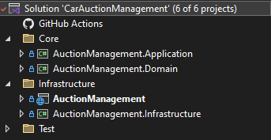

# CarAuctionManagement
A car auction management exercise in .NET 8.

## Solution design
The solution follows a Clean Architecture approach, separating the service into different layers, each with its own responsibilities.



It would've been possible to further separate the Application contracts/abstractions from itself, but it was deemed unnecessary for a project of this scale.

## Implementation details

The main objective was to leave the code simple, and do the entire project without adding any extra dependencies beyond Swagger.

This means that commonly used libraries were not used, but the following were still considered during the design stage of the solution:

- EntityFramework -> The exercise specifically mentions that no Database is required, but I still considered the usage of EF's InMemory option, but ultimately scrapped it.
- Automapper -> To reduce boilerplate related to mapping DTOs to the domain model.


### API Layer

Requests, Responses and DTOs were entirely separated, as it is more extensible in case the requirements of the endpoints of the application change. It also ensures that the DTOs aren't exactly what needs to be returned to the clients, allowing for more customised messages.

However, it can be considered "overkill" in this scenario, as in the cases of this project, multiple requests/responses do end up just being a reference to the DTO in question.


### Error handling

There were two options considered for handling errors:

- The "Result pattern", similar to the F# Result type. I've encountered real-application usage of this logic, but deemed it unnecessary for this project, in order to keep the code as simple as possible.
- A Global Exception Handler, that ensures all custom exceptions return a specific Status Code and error message. It isn't as performant as the above option, but it led to cleaner and simpler code, which I favored for this project.

### Application contract validations

DTOs and Requests both had annotations created in order to ensure business rules, such as validating the Vehicle Identification Number or that bids must be positive.

### Domain validations

Due to the smaller scope of the project, the domain-related validations were left entirely within the constructors of each class. 

Due to the approach chosen for the Database implementation, it was also necessary to ensure encapsulation of the properties, leading to Cloning methods.

### "Database" implementation

There were some options considered, once the before-mentioned EF.InMemory approach was ruled out. The two main objectives required were:

- Ensure the collection does not accept duplicated keys.
- Thread-proof the Database.
- Ensure Encapsulation of the model. This is a higher priority in the in-memory approach with collections because altering the collection in a superior layer (i.e. Application) would change things within the Database itself.

Thus, for each Database, a different implementation was used:
- Car-related DB: A ConcurrentDictionary, native to C# that handles both first requirements.
- Auction-related DB: A HashSet & the useage of a locking mechanism, locking per car VIN. This was preferred over the ConcurrentDictionary due to some operations not being entirely direct (i.e. Bidding on an Auction).


### Testing 

Unit & Integration tests were created for the solution, but each test project slightly differs from each other, due to the dependencies added.

- Unit: Makes use of MSTest to create, detect and run tests for each code unit.
- Integration: Uses xUnit instead of MSTest, due to the Microsoft documentation heavily favouring the use of xUnit for this type of testing.

Ideally the same testing lib would be used for both, but since this is a test exercise it was considered ok to show both types of implementation.


## Issues during development

There were a couple of issues that rose up during development, some of which will be raised for awareness here.

VIN isn't a perfect ID for a car entity. The format standard become a 17-digit alphanumeric on 1981, but there exist VIN's from prior to that year that would break the concept. Whilst this wouldn't be an issue for a majority of cars, old vintages could still be auctioned and lead to some issues.

Polymorphism in the /car endpoint. `System.Text.Json` can't handle Metadata in a class that requires polymorphism, so it wasn't possible to add annotation validations to the CarDTO. There were also some issues generating the necessary Swagger OpenAPI spec, as a `"$type"` is required in order to ensure a specific model is created.

Transaction rollbacks in the `Close An Active Auction` flow. When an Auction is closed, the Car related to it must also be marked as unnavailable. However, this procedure may also fail, so the transaction should be rolled back, but with the current implementation it wouldn't be possible without adding a new method to the AuctionDatabase to re-open an auction. 


### Examples of CreateCarRequest

```
{
  "car": {
    "$type": "sudan",
    "numberOfDoors": 2,
    "manufacturer": "Honda",
    "model": "Accord",
    "year": 2012,
    "startingBid": 10.14,
    "vin": "SET3DKJJFW9KY1281"
  }
}
```

```
{
  "car": {
    "$type": "hatchback",
    "numberOfDoors": 2,
    "manufacturer": "Honda",
    "model": "Discord",
    "year": 2016,
    "startingBid": 20.44,
    "vin": "SET3DKJJFW9KY1283"
  }
}
```

```
{
  "car": {
    "$type": "truck",
    "loadCapacity": 1500,
    "manufacturer": "Kia",
    "model": "Picanto",
    "year": 2012,
    "startingBid": 30.22,
    "vin": "SET3DKJJFW9KY1285"
  }
}
```

```
{
  "car": {
    "$type": "suv",
    "numberOfSeats": 4,
    "manufacturer": "Kia",
    "model": "Secanto",
    "year": 2016,
    "startingBid": 40.23,
    "vin": "SET3DKJJFW9KY1287",
    "isAvailable": false
  }
}
```